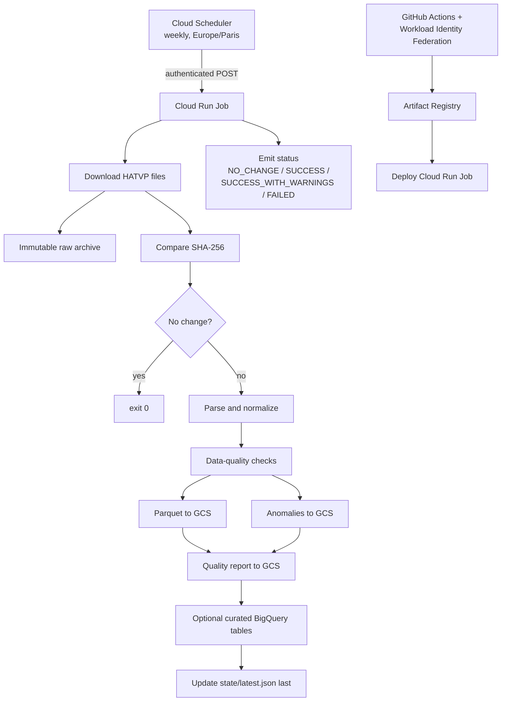

# YAHATVP

Yet Another HATVP Project: a small, auditable weekly ingestion pipeline for the
French Haute Autorité pour la Transparence de la Vie Publique (HATVP) open-data
datasets.

> Project status: the local end-to-end path is implemented and has been exercised
> against the current public HATVP files. The Cloud Run deployment is in place,
> and the weekly `hatvp-ingestion-weekly` Scheduler trigger runs the real
> ingestion job at 07:00 Europe/Paris. BigQuery is enabled for the initial
> `declarations`, `people`, `incomes`, and `assets` curated tables; the remaining
> normalized tables remain GCS-only until a later expansion.

## Goal

The pipeline downloads the two public HATVP datasets, detects changes using
SHA-256 hashes, preserves immutable raw snapshots, produces normalized Parquet
datasets, reports data-quality issues, and optionally publishes curated tables
to BigQuery.

The pipeline is deliberately small. It runs once per week as a Cloud Run Job;
Cloud Scheduler is only the trigger. GitHub Actions is used for CI/CD and
deployment, never as the weekly execution engine.

## Architecture



### Why Cloud Run Jobs?

This workload is a finite batch process that downloads files, transforms them,
writes artifacts, and exits. Cloud Run Jobs provide a managed container runtime,
retries, execution history, logs, and a clean non-zero exit status without
introducing an HTTP server or a workflow orchestrator. Cloud Scheduler supplies
the weekly trigger, so the application remains independently runnable locally.

The design intentionally does not use Airflow, Cloud Composer, Dataflow,
Kubernetes, Spark, Prefect, Dagster, or another orchestrator.

## Source datasets

The default source URLs are:

| Dataset | URL | Purpose |
| --- | --- | --- |
| CSV list | `https://www.hatvp.fr/livraison/opendata/liste.csv` | HATVP open-data list |
| XML declarations | `https://www.hatvp.fr/livraison/merge/declarations.xml` | Declaration data |

The implementation must inspect the current CSV header and XML structure before
finalizing normalized models. Do not invent fields based on a presumed schema.
Keep parsing separate from normalization, and use streaming XML parsing such as
`lxml.etree.iterparse` so the whole XML document is not loaded into memory.

## Repository layout

The implementation is organized by responsibility. The public `parser.py`,
`pipeline.py`, and `quality.py` modules remain small compatibility façades;
their focused implementations live beside them.

```text
hatvp-pipeline/
├── pyproject.toml
├── uv.lock
├── Dockerfile
├── README.md
├── agents.md
├── .gitignore
├── src/hatvp/
│   ├── __init__.py
│   ├── main.py
│   ├── config.py
│   ├── pipeline.yml
│   ├── models.py
│   ├── normalize.py
│   ├── hashing.py
│   ├── json_logging.py
│   ├── xml_support.py
│   ├── scheduler_smoke.py
│   ├── download/
│   │   ├── __init__.py            # download façade
│   │   └── validation.py
│   ├── tables/
│   │   ├── __init__.py            # Parquet writer façade
│   │   ├── columns.py
│   │   └── schema.py
│   ├── storage/
│   │   ├── __init__.py            # storage façade
│   │   ├── gcs.py
│   │   └── local.py
│   ├── parser/
│   │   ├── __init__.py            # stable parsing façade
│   │   ├── activities.py
│   │   ├── csv.py
│   │   ├── declaration_support.py
│   │   ├── declarations.py
│   │   ├── dispatch.py
│   │   ├── finance.py
│   │   ├── income.py
│   │   ├── income_fields.py
│   │   ├── mandate_fields.py
│   │   ├── mandate_general.py
│   │   ├── mandate_income.py
│   │   ├── mandates.py
│   │   └── stream.py
│   ├── pipeline/
│   │   ├── __init__.py            # orchestration façade
│   │   ├── artifacts.py
│   │   ├── bigquery.py
│   │   ├── result.py
│   │   ├── state.py
│   │   └── steps.py
│   ├── quality/
│   │   ├── __init__.py            # stable quality façade
│   │   ├── checks.py
│   │   ├── coverage.py
│   │   ├── helpers.py
│   │   ├── numeric.py
│   │   └── telemetry.py
│   ├── triage/
│   │   ├── __init__.py            # quality-review CLI façade
│   │   ├── __main__.py
│   │   ├── evidence.py
│   │   ├── evidence_helpers.py
│   │   ├── fingerprints.py
│   │   ├── matching.py
│   │   ├── register.py
│   │   ├── report.py
│   │   ├── snapshot.py
│   │   └── summary.py
│   └── bigquery/
│       ├── __init__.py            # curated-table façade
│       ├── loader.py
│       ├── sql.py
│       └── stage.py
├── tests/
│   ├── test_*.py
│   ├── *_support.py
│   └── fixtures/
└── .github/workflows/deploy.yml
```

Parser navigation, streaming, CSV, declaration/person, mandate/remuneration,
income, finance, and activity components live in the `parser/` package.
Pipeline orchestration and its state, artifacts, results, steps, and BigQuery
integration live in `pipeline/`. Quality checks live in `quality/`, source-linked
review generation lives in `triage/`, curated BigQuery loading lives in
`bigquery/`, storage adapters live in `storage/`, downloads live in `download/`,
and Parquet/table contracts live in `tables/`. Package `__init__.py` files are
the small façades used by the application; the focused modules below them are
the canonical internal import paths. Every tracked Python file, including tests
and package initializers, is intentionally kept between 70 and 100 physical
lines; `tests/test_module_line_budget.py` enforces this contract.

### Configuration

The packaged [`src/hatvp/pipeline.yml`](src/hatvp/pipeline.yml) contains the
non-secret runtime defaults and the observed HATVP XML/CSV schema rules. Typed
settings resolve values in this order: YAML defaults, environment variables,
then CLI overrides. Use environment variables for deployment configuration and
`--local-output` for local fixture runs; never put credentials in YAML.

Use Python 3.12 or newer and `uv`. Prefer a small dependency set:

- `httpx` for downloads
- `google-cloud-storage` for GCS
- `google-cloud-bigquery` for the optional analytical layer
- `lxml` for streaming XML parsing
- `polars` and `pyarrow` for tabular transformation and Parquet
- `pandera` for dataframe-level validation where useful
- `pydantic-settings` for configuration

## Data and state contract

### Change detection

For each downloaded file, compute SHA-256 over the exact downloaded bytes. Keep
separate XML and CSV hashes. If both match the latest successful state, return
success with `NO_CHANGE` and do not write derived outputs. Use `--force` to
reprocess unchanged inputs intentionally.

The implementation may later add semantic/content hashes, but should not add
that complexity until it is needed.

### GCS layout

Configure one bucket and keep the HATVP prefix stable:

```text
gs://<bucket>/hatvp/
├── raw/snapshot_date=YYYY-MM-DD/
│   ├── declarations.xml
│   ├── liste.csv
│   └── metadata.json
├── silver/declarations/snapshot_date=YYYY-MM-DD/data.parquet
├── silver/mandate_remunerations/snapshot_date=YYYY-MM-DD/data.parquet
├── silver/incomes/snapshot_date=YYYY-MM-DD/data.parquet
├── silver/assets/snapshot_date=YYYY-MM-DD/data.parquet
├── quarantine/snapshot_date=YYYY-MM-DD/anomalies.parquet
├── quality/snapshot_date=YYYY-MM-DD/report.json
└── state/latest.json
```

Raw objects are immutable. Never overwrite a historical snapshot. Derived files
may be deterministically rewritten when retrying the same snapshot after a
partial failure.

`state/latest.json` is advanced only after every required stage succeeds:

```json
{
  "snapshot_date": "2026-08-17",
  "fetched_at": "2026-08-17T08:00:00+02:00",
  "xml_sha256": "...",
  "csv_sha256": "...",
  "pipeline_git_sha": "...",
  "pipeline_version": "..."
}
```

A failed download, parse, normalization, quality check, Parquet write, or
BigQuery load must never advance this state.

### Normalized data

Start with entities supported by the observed HATVP source schema. Logical tables
include declarations, people, incomes, elected mandates and their annual
remunerations, activities, assets, and companies/participations, but the source
data is authoritative.

Preserve source values and provenance. For fields that are normalized, keep the
equivalent of:

```text
raw_value | normalized_value | quality_status | quality_reason
```

Deterministic formatting transformations are `FIX` operations: trimming
whitespace, normalizing empty strings, parsing known date formats, and converting
French numbers such as `"50 000,00"` to `50000.00`. Suspicious but plausible
source values are `FLAG` operations. Structural failures that make safe
processing impossible are `FAIL` operations.

Do not silently discard or rewrite suspicious declarations. Quarantine keeps
flagged records available for review; it is not a delete path.

## Data-quality philosophy

Quality checks should be reusable and should produce both machine-readable
results and concise structured logs.

Checks should cover:

- expected columns and data types;
- required identifiers and uniqueness where appropriate;
- declaration, people, income, and asset row counts;
- source-aware income coverage: declarations with an income section, declarations
  with populated income rows, populated numeric income rows, and empty income
  sections;
- null rates and drastic changes from the previous snapshot;
- duplicate stable identifiers;
- negative values where a value is semantically impossible;
- implausibly large incomes or assets;
- robust statistical outliers, preferably using median/MAD where useful;
- referential integrity between normalized tables where IDs exist.

Never deduplicate people solely by first name and surname. Names can legitimately
collide. Name-based duplicates should only create a quality flag; stable HATVP
declaration identifiers, source IDs, URLs, or mandate metadata should drive
identity decisions.

Every changed snapshot should produce a report shaped like:

```json
{
  "snapshot_date": "2026-08-17",
  "status": "warning",
  "counts": {
    "declarations": 12345,
    "people": 4567,
    "incomes": 7890
  },
  "quality": {
    "errors": 0,
    "warnings": 31,
    "flagged_records": 28
  },
  "checks": {
    "duplicate_declaration_ids": 0,
    "huge_income": 3,
    "huge_assets": 2
  }
}
```

Use the execution statuses `NO_CHANGE`, `SUCCESS`,
`SUCCESS_WITH_WARNINGS`, and `FAILED`. Warnings may complete the pipeline;
structural errors must fail it.

### Normalized table reference

Every normalized table keeps `snapshot_date` and source provenance. XML-derived
child tables also keep `declaration_uuid`; repeated or suspicious source rows
remain available with `quality_status`, `quality_reason`, and, where applicable,
`raw_record_json`. `raw_value` is the source text and `normalized_value` is the
parsed numeric value; parsing does not imply that a value is valid.

| Table | Grain and purpose | Important fields |
| --- | --- | --- |
| `liste` | One row per CSV source listing record. | Source CSV columns, `snapshot_date`, `source_file` |
| `declarations` | One row per XML declaration. | `declaration_uuid`, deposit and mandate dates, declaration type, mandate and organ labels |
| `people` | One declarant row per declaration. | Name, contact, birth date, and address fields |
| `mandates` | One row per general or elected-mandate section item. | `source_section`, description, dates, employer, remuneration |
| `mandate_remunerations` | One row per annual remuneration value nested in an elected mandate item. | `source_item_index`, description, remuneration basis, `remuneration_year`, `raw_value`, `normalized_value` |
| `activities` | One row per professional, consulting, spouse, volunteer, or collaborator activity. | `source_section`, description, employer, dates, remuneration |
| `participations` | One row per financial or management participation. | Company, valuation, capital held, number of shares, raw record |
| `incomes` | One row per populated declared income category or annual elected-mandate remuneration value. Empty category slots are excluded; `income_stream` distinguishes the source stream. | `income_stream`, `income_year`, `income_type`, `raw_value`, `normalized_value`, spouse value |
| `assets` | One row per observed asset DTO item, including bank accounts, insurance, securities, vehicles, and foreign assets. | `source_section`, asset name, `raw_value`, `normalized_value`, quality fields |
| `liabilities` | One row per declared debt or liability item. | `source_section`, description, `raw_value`, `normalized_value`, raw record |

### First production snapshot quality triage

The complete report catalog is [`reports/00-index.md`](reports/00-index.md).
It groups quality review, outlier analysis, validation, and manual-review
bundles under numbered topic folders.

The 2026-08-16 report had zero errors, 3,510 warnings, and 5,763 flagged
records. The complete source-linked review is recorded in the
[`2026-08-16-quality-triage.md`](reports/01-quality/2026-08-16-quality-triage.md) report and
the row-level
[`2026-08-16-quality-triage.json`](reports/01-quality/2026-08-16-quality-triage.json)
register. All 5,763 flagged rows matched the immutable raw XML and persisted
normalized records: 5,599 repeated-name rows are expected identity-collision
flags and are not deduplicated; 143 robust asset outliers remain retained
statistical review flags; and nine small negative bank-account values are
source-valid overdraft-style values that remain flagged. The six duplicate
declaration UUID groups are source-quality follow-ups: all six groups are
semantically identical source duplicates, with one pair differing only by
trailing whitespace.

The report can be regenerated from a read-only artifact store with ADC:

```bash
uv run python -m hatvp.triage \
  --bucket yahatvp-pipeline-eu-data \
  --prefix hatvp \
  --snapshot-date 2026-08-16 \
  --output-dir reports/01-quality
```

Income coverage is source-dependent but the curated `incomes` table now
combines both observed revenue streams. Rows from `revenuMandatDto` use
`income_stream=revenu_mandat` and contain populated elected-person or fallback
total values; empty fixed category slots are excluded. Rows from
`mandatElectifDto` use `income_stream=mandate_remuneration` and preserve one
row per annual source year/value, including explicit zeroes. The detailed
`mandate_remunerations` table remains available with the remuneration-specific
fields and the same raw source record, so this is an additional curated view,
not a lossy replacement or silent deduplication.

The quality report records `income_rows_by_stream` and
`income_declarations_by_stream` alongside `income_section_declarations`,
`income_declarations`, `income_rows_with_numeric_value`,
`income_sections_without_rows`, `mandate_remuneration_declarations`, and
`mandate_remuneration_rows_with_numeric_value`. This keeps the sparse
`revenuMandatDto` population visible while making annual elected-mandate
remuneration available to standard income queries.

## Configuration

The packaged `src/hatvp/pipeline.yml` supplies non-secret runtime and observed
schema defaults. Typed settings apply environment variables over those defaults;
CLI arguments such as `--local-output` are applied last. Credentials remain in
runtime identity configuration and never belong in YAML or source code:

```text
HATVP_BUCKET=<required for GCS mode>
HATVP_PREFIX=hatvp
HATVP_ENABLE_BIGQUERY=false
HATVP_BIGQUERY_PROJECT=<optional>
HATVP_BIGQUERY_DATASET=hatvp
HATVP_BIGQUERY_LOCATION=europe-west1
HATVP_XML_URL=https://www.hatvp.fr/livraison/merge/declarations.xml
HATVP_CSV_URL=https://www.hatvp.fr/livraison/opendata/liste.csv
```

Run `uv run pytest` to execute the fixture suite and the tracked-file line-budget
check. Pull requests run these checks and `uv build`; Cloud Run deployment is
only eligible for a push on `main`.

The downloader should use connect/read timeouts, bounded retries, a descriptive
user agent, HTTP status validation, and elapsed-time/size/hash logging. Never
accept an HTTP error page as a dataset and never log secrets.

## Local development

### No Google Cloud required

Local output mode is the fastest path for parser and quality work:

```bash
uv sync
uv run python -m hatvp.main --local-output ./data
uv run python -m hatvp.main --local-output ./data --dry-run
uv run python -m hatvp.main --local-output ./data --force
```

`--dry-run` must not mutate GCS, BigQuery, or state. `--force` reprocesses even
when hashes are unchanged. Normal unit tests must use small fixtures and must
not require live HATVP or Google Cloud access.

Before implementing models, inspect representative source data locally. Keep
fixtures small and sanitized:

```bash
curl --fail --location --retry 3 \
  --output /tmp/hatvp-liste.csv \
  https://www.hatvp.fr/livraison/opendata/liste.csv

curl --fail --location --retry 3 \
  --output /tmp/hatvp-declarations.xml \
  https://www.hatvp.fr/livraison/merge/declarations.xml

head -n 3 /tmp/hatvp-liste.csv
xmllint --noout /tmp/hatvp-declarations.xml
```

The first acceptance fixture is a single declaration extracted from the
observed live XML at `tests/fixtures/declaration_single_real.xml`. The broader
fixture adds a second declaration with the same name so identity and
duplicate-name handling can be tested without deduplicating people.

For manual review of a live declaration, see
[`reports/04-manual-review/2026-08-17/6dcd326d-e076-4d7a-a428-15075a15dddd/`](reports/04-manual-review/2026-08-17/6dcd326d-e076-4d7a-a428-15075a15dddd/).
It contains the selected XML declaration and the associated normalized rows
with source hashes and parser provenance.

### Local Google Cloud access

You do not need to log in to GCloud just to read or edit this repository, run
fixture-based unit tests, or use `--local-output`.

You do need Google Cloud access before running a real GCS/BigQuery integration or
deploying the job. For local client-library access, use Application Default
Credentials (ADC):

```bash
gcloud auth login
gcloud config set project <PROJECT_ID>
gcloud auth application-default login
gcloud auth application-default set-quota-project <PROJECT_ID>
```

Do not create or commit service-account JSON keys. Cloud Run should use its
runtime service account; GitHub Actions should use Workload Identity Federation.

### Tests

Run the project checks with:

```bash
uv run pytest
uv run ruff check .
uv run ruff format --check .
```

At minimum, tests must cover SHA-256 behavior, unchanged-snapshot detection,
changed XML and CSV hashes, French numeric normalization, missing values,
implausible-value flags, duplicate-name behavior, duplicate stable identifiers,
catastrophic row-count reductions, immutable raw snapshots, BigQuery failure
gating, required XML structure, and state remaining unchanged after a failed
pipeline.

## BigQuery

BigQuery is optional and is the curated/gold analytical layer. GCS remains the
archive and source of truth. The application must work with
`HATVP_ENABLE_BIGQUERY=false`.

The initial curated layer publishes only `declarations`, `people`, `incomes`,
and `assets`. Other normalized tables remain available in GCS and can be added
after the first BigQuery validation. Every curated table includes
`snapshot_date` as a `DATE` and is partitioned by that column. BigQuery loading
is part of the success gate: if a required load fails, do not advance
`state/latest.json`.

The `hatvp` dataset is created once by an operator in the same region as the
archive bucket. The Cloud Run runtime does not create datasets; it only needs
project-level BigQuery job execution and dataset-level table write access:

```bash
export PROJECT_ID="yahatvp-pipeline-eu"
export REGION="europe-west1"
export DATASET="hatvp"
export RUNTIME_SA_EMAIL="hatvp-runtime@${PROJECT_ID}.iam.gserviceaccount.com"

bq --location="$REGION" mk --dataset "${PROJECT_ID}:${DATASET}"
gcloud projects add-iam-policy-binding "$PROJECT_ID" \
  --member="serviceAccount:${RUNTIME_SA_EMAIL}" \
  --role="roles/bigquery.jobUser"
bq --project_id="$PROJECT_ID" --location="$REGION" query \
  --use_legacy_sql=false \
  "GRANT \`roles/bigquery.dataEditor\` ON SCHEMA \`${PROJECT_ID}.${DATASET}\` TO \"serviceAccount:${RUNTIME_SA_EMAIL}\""
```

Useful validation queries for the first curated snapshot are:

```sql
SELECT table_name, partition_id, total_rows
FROM `yahatvp-pipeline-eu.hatvp.INFORMATION_SCHEMA.PARTITIONS`
WHERE partition_id = '20260817'
  AND table_name IN ('declarations', 'people', 'incomes', 'assets');

SELECT table_name, column_name, data_type
FROM `yahatvp-pipeline-eu.hatvp.INFORMATION_SCHEMA.COLUMNS`
WHERE column_name = 'snapshot_date';

```

## Transparency dashboard

The repository also contains a deliberately small public dashboard under
`website/hatvp-transparency-dashboard/`. It is separate from the ingestion
pipeline and reads only aggregate data from the four curated BigQuery tables:
`declarations`, `people`, `incomes`, and `assets`.

```text
GitHub Pages React app
        │ GET /api/dashboard
        ▼
Cloudflare Worker
        │ authenticated aggregate request
        ▼
Read-only Cloud Run bridge ─── BigQuery curated tables
```

The public API does not expose arbitrary SQL, raw rows, addresses, contact
fields, or other personal fields. The bridge selects the latest shared
`snapshot_date`, returns table counts, income-stream totals, asset-section
totals, and declaration-type counts. The Worker adds CORS and a short cache
header so the weekly source does not require a query on every page refresh.

### Local dashboard checks

Install the two JavaScript workspaces and run their fixture-only checks:

```bash
make dashboard-install
make backend-test
make frontend-test
```

Copy `website/hatvp-transparency-dashboard/backend/worker/.dev.vars.example`
to `.dev.vars` for local Worker development. Set
`VITE_API_BASE_URL=http://localhost:8787` in
`website/hatvp-transparency-dashboard/frontend/.env.local` and use
`make backend-dev` and `make frontend-dev` in separate terminals.

### Dashboard deployment

The deployment requires `gcloud` access for the read-only bridge and the
existing `wrangler login` session for the Worker. No service-account JSON key is
needed or accepted. Set a random shared bridge token once, then deploy the
backend:

```bash
export BRIDGE_TOKEN="<random-token>"
make backend-secrets
make backend-deploy
make frontend-deploy VITE_API_BASE_URL="<WORKER_URL>"
```

The Makefile creates or reuses the `hatvp-dashboard-reader` service account,
grants it BigQuery job execution plus dataset-level read-only access, deploys
the bridge with Secret Manager, and then deploys the Worker with the resolved
bridge URL. `frontend-deploy` builds the Vite app and publishes `dist/` to the
`gh-pages` branch using the `gh-pages` npm module. Override `GCP_PROJECT_ID`,
`GCP_REGION`, `BQ_DATASET`, `BRIDGE_SERVICE`, and `FRONTEND_ORIGIN` when using
different resources.

The initial deployment is available at
[GitHub Pages](https://louispaulet.github.io/YAHATVP/) and uses the Worker API
at `https://hatvp-transparency-api.louispaulet13.workers.dev`. The deployed
Worker health check and aggregate endpoint returned HTTP 200 after deployment;
the bridge remains protected by its shared token and is not a public data
endpoint.

## Google Cloud deployment

The commands below are a deployment checklist. Replace every placeholder before
running them. Choose a region close to the data consumers; the schedule itself
uses `Europe/Paris` and is not tied to UTC.

### 1. Set variables and enable APIs

```bash
export PROJECT_ID="<PROJECT_ID>"
export REGION="europe-west1"
export SCHEDULER_REGION="europe-west1"
export REPOSITORY="hatvp"
export JOB_NAME="hatvp-ingestion"
export BUCKET_NAME="${PROJECT_ID}-hatvp"
export RUNTIME_SA="hatvp-runtime"
export SCHEDULER_SA="hatvp-scheduler"
export RUNTIME_SA_EMAIL="${RUNTIME_SA}@${PROJECT_ID}.iam.gserviceaccount.com"
export SCHEDULER_SA_EMAIL="${SCHEDULER_SA}@${PROJECT_ID}.iam.gserviceaccount.com"
export PROJECT_NUMBER="$(gcloud projects describe "$PROJECT_ID" --format='value(projectNumber)')"
export IMAGE="${REGION}-docker.pkg.dev/${PROJECT_ID}/${REPOSITORY}/hatvp:latest"

gcloud config set project "$PROJECT_ID"
gcloud services enable \
  artifactregistry.googleapis.com \
  bigquery.googleapis.com \
  cloudscheduler.googleapis.com \
  logging.googleapis.com \
  run.googleapis.com \
  storage.googleapis.com
```

### 2. Create storage, Artifact Registry, and service accounts

```bash
gcloud storage buckets create "gs://${BUCKET_NAME}" \
  --location="$REGION" \
  --uniform-bucket-level-access

gcloud artifacts repositories create "$REPOSITORY" \
  --repository-format=docker \
  --location="$REGION" \
  --description="HATVP pipeline images"

gcloud iam service-accounts create "$RUNTIME_SA" \
  --display-name="HATVP Cloud Run runtime"

gcloud iam service-accounts create "$SCHEDULER_SA" \
  --display-name="HATVP Cloud Scheduler invoker"

gcloud storage buckets add-iam-policy-binding "gs://${BUCKET_NAME}" \
  --member="serviceAccount:${RUNTIME_SA_EMAIL}" \
  --role="roles/storage.objectAdmin"
```

`roles/storage.objectAdmin` is scoped to the dedicated HATVP bucket in this
example. Tighten it further with organization-specific IAM conditions if your
environment requires prefix-level controls. If BigQuery is enabled, grant the
runtime identity only the required BigQuery job and dataset write permissions.

### 3. Build and publish the image

For a one-off manual deployment, Cloud Build can build and push the image:

```bash
gcloud builds submit --tag "$IMAGE" .
```

Normal deployments should be performed by the GitHub Actions workflow after
linting and tests pass. The weekly execution never runs from GitHub Actions.

### 4. Create or update the Cloud Run Job

```bash
gcloud run jobs deploy "$JOB_NAME" \
  --region="$REGION" \
  --image="$IMAGE" \
  --service-account="$RUNTIME_SA_EMAIL" \
  --tasks=1 \
  --max-retries=1 \
  --task-timeout=30m \
  --set-env-vars="HATVP_BUCKET=${BUCKET_NAME},HATVP_PREFIX=hatvp,HATVP_ENABLE_BIGQUERY=true,HATVP_BIGQUERY_PROJECT=${PROJECT_ID},HATVP_BIGQUERY_DATASET=hatvp,HATVP_BIGQUERY_LOCATION=${REGION}"
```

Run a manual smoke test and wait for the result:

```bash
gcloud run jobs execute "$JOB_NAME" --region="$REGION" --wait
```

### 5. Validate and connect the weekly Scheduler trigger

For trigger-only validation, use the versioned `hatvp.scheduler_smoke` entrypoint
instead of the ingestion command. It emits one structured success event and
exits zero without downloading HATVP data or writing GCS state. The current
smoke task version is `1.0.0`.

Create a separate Cloud Run Job for the smoke workload using the same image that
contains the entrypoint:

```bash
export SMOKE_JOB_NAME="hatvp-scheduler-smoke"

gcloud run jobs deploy "$SMOKE_JOB_NAME" \
  --project="$PROJECT_ID" \
  --region="$REGION" \
  --image="$IMAGE" \
  --command=python \
  --args=-m,hatvp.scheduler_smoke \
  --service-account="$RUNTIME_SA_EMAIL" \
  --tasks=1 \
  --max-retries=0 \
  --task-timeout=1m
```

Grant the Scheduler identity access to this smoke job and create the weekly
test trigger. The smoke trigger is used to validate authenticated Scheduler
delivery before the production handoff:

```bash
gcloud run jobs add-iam-policy-binding "$SMOKE_JOB_NAME" \
  --project="$PROJECT_ID" \
  --region="$REGION" \
  --member="serviceAccount:${SCHEDULER_SA_EMAIL}" \
  --role="roles/run.invoker"

gcloud scheduler jobs create http "${SMOKE_JOB_NAME}-weekly" \
  --project="$PROJECT_ID" \
  --location="$SCHEDULER_REGION" \
  --schedule="0 7 * * 1" \
  --time-zone="Europe/Paris" \
  --uri="https://run.googleapis.com/v2/projects/${PROJECT_ID}/locations/${REGION}/jobs/${SMOKE_JOB_NAME}:run" \
  --http-method=POST \
  --oauth-service-account-email="$SCHEDULER_SA_EMAIL" \
  --message-body='{}' \
  --headers="Content-Type=application/json"
```

To validate delivery without waiting for Monday, temporarily update the smoke
trigger to a Paris-local minute a few minutes in the future, wait for the Cloud
Run execution to complete, and then restore `0 7 * * 1`. Confirm the execution
and the `scheduler_smoke_task_version` field in Cloud Logging before considering
the trigger validated.

Grant the dedicated Scheduler identity permission to run this specific job:

```bash
gcloud run jobs add-iam-policy-binding "$JOB_NAME" \
  --region="$REGION" \
  --member="serviceAccount:${SCHEDULER_SA_EMAIL}" \
  --role="roles/run.invoker"
```

Create a Monday morning schedule in Paris time. Adjust the hour to the desired
operational window:

```bash
gcloud scheduler jobs create http "${JOB_NAME}-weekly" \
  --project="$PROJECT_ID" \
  --location="$SCHEDULER_REGION" \
  --schedule="0 7 * * 1" \
  --time-zone="Europe/Paris" \
  --uri="https://run.googleapis.com/v2/projects/${PROJECT_ID}/locations/${REGION}/jobs/${JOB_NAME}:run" \
  --http-method=POST \
  --oauth-service-account-email="$SCHEDULER_SA_EMAIL" \
  --message-body='{}' \
  --headers="Content-Type=application/json"
```

The Cloud Run Jobs API endpoint is authenticated with OAuth, and the Scheduler
service account needs the Cloud Run Invoker role on the job. See Google’s
[Cloud Run Jobs scheduling guide](https://cloud.google.com/run/docs/execute/jobs-on-schedule)
for the current command and permission details.

The current production trigger is `hatvp-ingestion-weekly` (`0 7 * * 1`,
`Europe/Paris`) and targets the `hatvp-ingestion:run` endpoint. The validated
`hatvp-scheduler-smoke-weekly` trigger is paused after the handoff. A production
delivery completed with `NO_CHANGE`, and a repeat delivery also completed with
`NO_CHANGE`, without creating a new derived snapshot.

### 6. GitHub Actions and Workload Identity Federation

The deployment workflow should run on pushes to `main` and:

1. check out the repository;
2. install Python and `uv`;
3. run linting and tests;
4. authenticate with `google-github-actions/auth` using GitHub OIDC;
5. build and push the image to Artifact Registry;
6. deploy/update the Cloud Run Job.

The workflow must grant only `id-token: write` and `contents: read` as required,
and must not use a long-lived GCP JSON credential. Restrict the workload identity
provider condition to this repository, then grant the deploy identity only the
Artifact Registry and Cloud Run permissions it needs. If the deploy identity
uses the runtime service account, grant the narrow `roles/iam.serviceAccountUser`
permission on that service account.

The official Google setup guide is
[Configure Workload Identity Federation with deployment pipelines](https://cloud.google.com/iam/docs/workload-identity-federation-with-deployment-pipelines).

## Operations and troubleshooting

List recent executions:

```bash
gcloud run jobs executions list \
  --job="$JOB_NAME" \
  --region="$REGION"
```

Read recent Cloud Run Job logs:

```bash
gcloud logging read \
  'resource.type="cloud_run_job" AND resource.labels.job_name="hatvp-ingestion"' \
  --limit=50 \
  --format=json
```

The ingestion job emits structured events named `download_complete`,
`hash_comparison`, `quality_complete`, `pipeline_complete`, and
`pipeline_failed`. Repeated warning snapshots emit `quality_warning_streak`,
and flagged-record increases above the 10% threshold emit
`quality_regression`. The normal full-run sequence includes source URLs, exact
SHA-256 hashes, quality counts, snapshot date, and the final status; it must
never include credentials or access tokens.

Operational retention verification and Cloud Monitoring alert setup are
documented in the [monitoring and retention runbook](ops/monitoring/README.md).
The production baseline retains the locked `_Required` audit bucket for 400
days and the `_Default` application bucket for 30 days. The runbook also
configures alerts for failed `hatvp-ingestion` executions, repeated quality
warnings, and flagged-record regressions above 10%.

Run the Scheduler job immediately:

```bash
gcloud scheduler jobs run "${JOB_NAME}-weekly" \
  --location="$SCHEDULER_REGION"
```

Common diagnoses:

- `NO_CHANGE`: both raw hashes match `state/latest.json`; this is a successful,
  intentionally short execution.
- `FAILED` before raw archival: inspect the source URL, timeout, status code,
  and response size; an HTML error page must not be archived as a dataset.
- `FAILED` during parsing: preserve the previous state, inspect the source
  schema change, and add a focused fixture before changing normalization.
- `SUCCESS_WITH_WARNINGS`: the snapshot is current, but the quality report and
  quarantine output require review.
- Scheduler returns permission errors: confirm the Scheduler service account
  has `roles/run.invoker` on the Cloud Run Job and that the OAuth target is the
  Cloud Run Jobs `:run` endpoint for the correct project and region.
- BigQuery-only failures: disable BigQuery for local development or repair the
  dataset/table permissions; do not bypass the state-update gate in production.

## Security and data handling

- Use Application Default Credentials locally and the Cloud Run service account
  in production.
- Use GitHub OIDC Workload Identity Federation for CI/CD.
- Never store service-account JSON keys in the repository, GitHub Secrets, the
  container image, or GCS.
- Never log access tokens, credentials, or sensitive environment values.
- Keep raw data immutable and preserve source identifiers and provenance.
- Treat anomalies as reviewable data, not as a reason to silently delete rows.

## Engineering guardrails

Keep the implementation specific to HATVP, with clear boundaries between:

1. downloading and hashing;
2. raw storage and state;
3. parsing;
4. normalization;
5. quality checks;
6. Parquet and optional BigQuery output.

Prefer deterministic, testable functions over a generic data-engineering
framework. The first milestone is a minimal end-to-end local run backed by
fixtures. The initial GCS-backed and curated BigQuery paths are now validated.
Keep additional BigQuery tables behind a focused schema and quality review.
